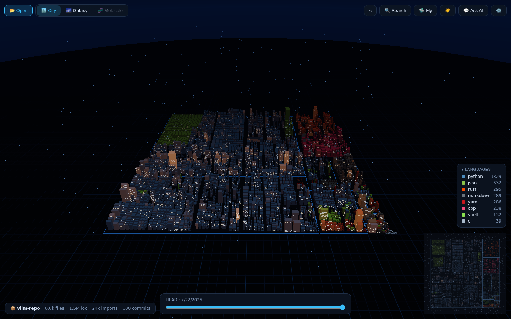
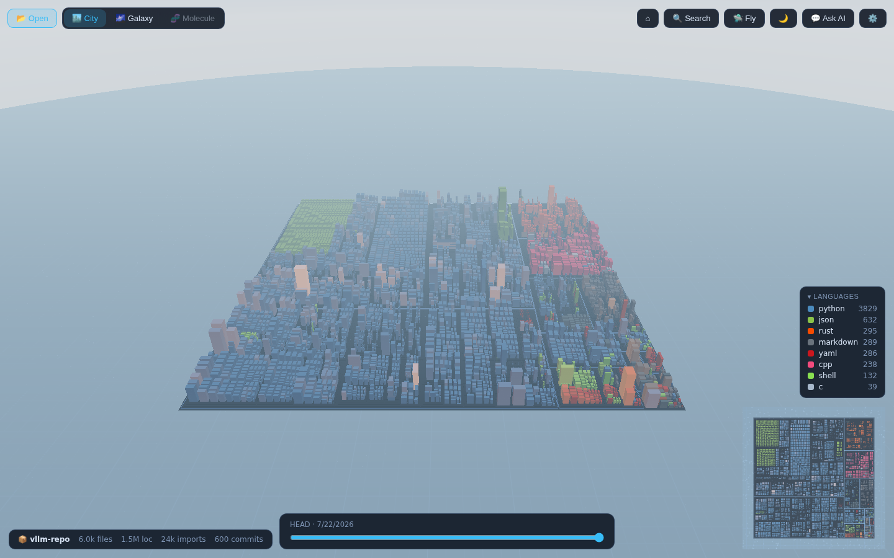
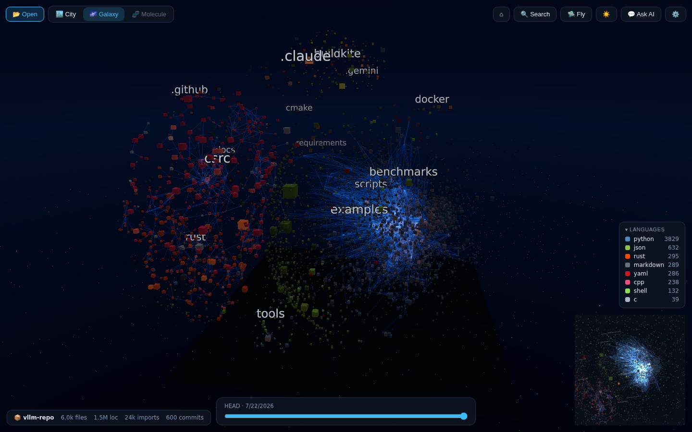
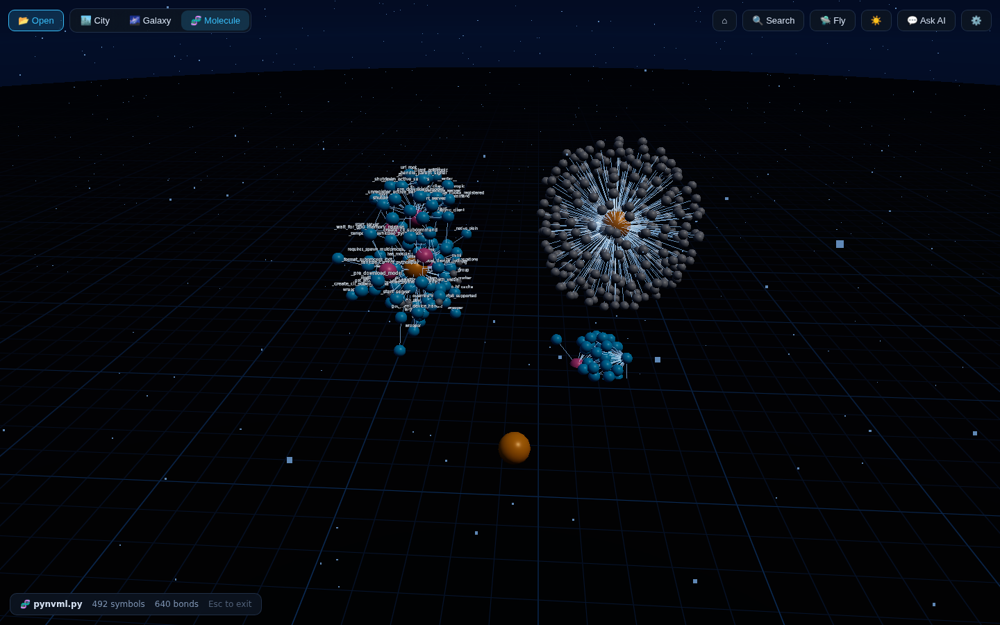
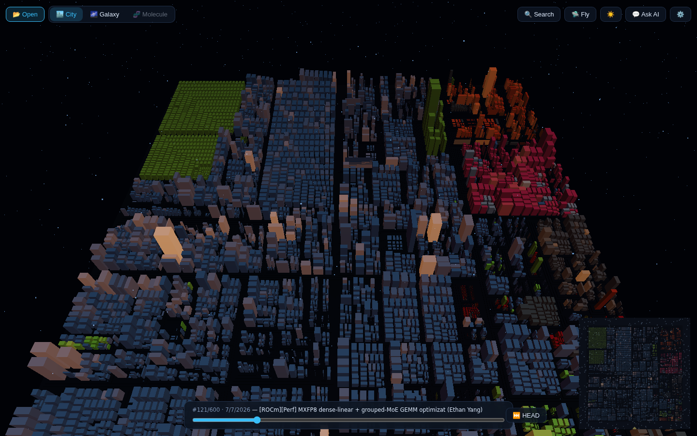

<div align="center">

# ⛩ Code Atlas

### Your codebase is a place. Go there.

**A desktop app that turns any repository into a living, navigable 3D world** — fly through your code as a neon city, watch it cluster into a dependency galaxy, and explode any file into a molecule of its functions.

[](https://www.electronjs.org/)
[](https://threejs.org/)
[](https://react.dev/)
[](https://www.typescriptlang.org/)
[](https://tree-sitter.github.io/)
[](#install)
[](LICENSE)



*vLLM (~6,000 files, 1.5M LOC, 23,574 resolved imports) — analyzed and rendered in seconds.*

</div>

---

## Three worlds, one codebase

| 🏙 **City** | 🌌 **Galaxy** | 🧬 **Molecule** |
|---|---|---|
| Folders are districts, files are buildings. Height = lines of code, color = language, glowing windows = git churn. | Files become stars, imports become gravity. Watch your architecture cluster itself in 3D space. | Double-click any building: its functions, classes and variables become atoms; calls become bonds. |
|  |  |  |

The three views **morph into each other** — buildings lift off and fly into orbit, then collapse back into streets. Same objects, same selection, same picking; only the physics change.

## ⏪ Scrub through time



Drag the timeline and watch the city **replay its own git history** — buildings rise from empty lots as files are born, grow with every commit, and sink away when deleted. Keyframed folding keeps even a hard slider yank instant.

## ✨ Everything else in the box

- **🔍 Polyglot analysis** — real parsing via tree-sitter (WASM) for **JS / TS / TSX / Python / Go / Rust / C / C++ / Java**, with graceful stats-only fallback for everything else. Zero native modules; nothing to rebuild, ever.
- **🕸 Dependency arcs** — hover any file and glowing bezier arcs light up everything it imports and everything that imports it.
- **🛸 Two flight modes** — orbit with **zoom-to-cursor**, or hit `Tab` for pointer-locked WASD free-flight with altitude-scaled speed: crawl the streets, sprint the skyline.
- **⌨️ Fly-to search** — `Ctrl+K`, fuzzy-match any file, and the camera sweeps you to its rooftop.
- **📖 Code preview** — click a building for shiki-highlighted source in a side panel.
- **🤖 Local-AI native** — point it at an IP and it auto-detects **vLLM, llama.cpp, LM Studio (OpenAI-compatible) or Ollama**. Ask the built-in chat about your architecture — it answers with the selected file's source and its import neighborhood as context, streamed token by token. No cloud, no keys, no telemetry.
- **🏷 Ambient intelligence** — district and cluster name labels, file labels that fade in when you stop to look, a language legend, a live stats HUD, a minimap, day/night themes, bloom, fog and drifting particles.
- **🏠 Never lost** — `H` reframes any view perfectly; idle in the galaxy and the camera begins a slow cinematic orbit.

## Install

Grab a build from [Releases](../../releases), or build from source:

```bash
git clone https://github.com/mtecnic/code-atlas.git
cd code-atlas
npm install        # Node ≥ 20
npm run dev        # hot-reloading dev app
```

Package for Linux (`.deb` + AppImage):

```bash
npm run build:linux
sudo dpkg -i dist/code-atlas_*_arm64.deb
```

> Analysis quality is best on a git repository (churn heat + timeline need history), but any plain folder works.

### Hook up a local LLM

Open **⚙ Settings**, type an IP or host (port optional — common ports are probed automatically), hit **Detect**. That's it. vLLM, llama.cpp's `llama-server`, LM Studio and Ollama are all recognized; pick a model from the dropdown and the **✨ Explain** button and **💬 Ask AI** chat go live.

## Keyboard & mouse

| Input | Action |
|---|---|
| `Drag` / `Wheel` | Orbit / zoom toward cursor |
| `Click` | Select file → code preview |
| `Double-click` | Explode file into molecule view |
| `Tab` | Toggle fly mode (`WASD` move, `Q/E` down/up, `Shift` boost) |
| `Ctrl+K` | Fuzzy search → fly to file |
| `H` | Reframe current view |
| `Esc` | Back out (molecule → city, close panels) |

## How it works

```
┌─ Electron main ──────────────────────────────┐   ┌─ Renderer ─────────────────────────┐
│ scanner        git ls-files / walk           │   │ zustand store ⇄ React panels       │
│ parse pool     Piscina × web-tree-sitter     │   │ SceneManager                       │
│ import resolver per-language heuristics      │──▶│  ├ WorldLayer   city ⇄ galaxy morph│
│ symbol graph   defs + call sites             │IPC│  ├ MoleculeLayer atoms & bonds     │
│ git history    streamed numstat + renames    │   │  ├ CameraRig    orbit/fly/framing  │
│ LLM proxy      probe + SSE streaming         │   │  └ TimeMachine  history folding    │
└──────────────────────────────────────────────┘   └────────────────────────────────────┘
```

- **One snapshot crosses IPC** (flat typed arrays, ~10 MB for 10k files); symbol graphs are fetched lazily per file.
- **10k buildings = 1 draw call** — a single `InstancedMesh` with per-instance color, heat, and glow attributes; the lit windows are procedural shader work (per-instance scale recovered from the instance matrix, so window size stays constant in world units on every building).
- **View morphs are free** — every entity exponentially smooths toward its current view's target arrays; the transition *is* the animation system.
- **Force layouts run in a Web Worker** (d3-force-3d), posting transferable position frames so the galaxy visibly settles into place.

## Dev

```bash
npm run typecheck      # strict TS, main + renderer
npm run dev            # electron-vite HMR
npm run build:linux    # package
```

Headless testing hooks (used for automated screenshots):

```bash
ATLAS_OPEN=/path/to/repo ATLAS_MODE=galaxy ATLAS_SHOT=/tmp/shot.png \
ATLAS_SHOT_DELAY=45000 xvfb-run -a npx electron out/main/index.js
```

---

<div align="center">

**Built for people who think codebases are worth seeing.**

*Bundled UI font: [DejaVu Sans](https://dejavu-fonts.github.io/) (free license).*

</div>
